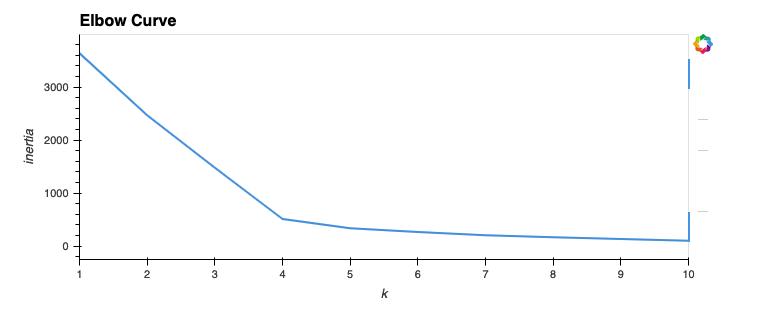
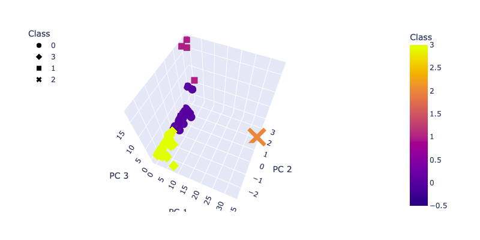
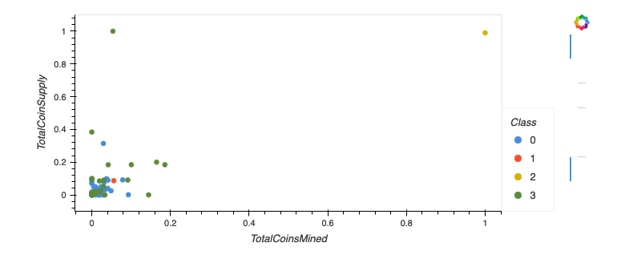

# Cryptocurrencies

## Overview of the analysis 
The purpose of this analysis is to analyze what cryptocurrencies are on the trading market and how they could be grouped to create a classification system. Since there is no known output for the report I am looking for, I use unsupervised learning to group the cryptocurrenciesand I use data visualizations to share my findings.
I provide the following analysis:

1. Preprocess the Data for PCA
2. Reduce Data Dimensions Using PCA
3. Cluster Cryptocurrencies Using K-means
4. Visualize Cryptocurrencies Results

The data for this analysis is retrieved from [Crypto Compare](https://min-api.cryptocompare.com/data/all/coinlist).

## Results

There are 532 tradable cryptocurrencies that are being traded and where coins have been mined. I use an Elbow Curve to determine the best value for k for the clustering.

The following diagram shows the Elbow Curve and based on the graph the value for k I am using for cluserting is 4.

The 3D Scatter Plot is shown below:

The table with Cryptocurrencies and their classification is available [here](images/plot.html).

The final 2D Scatter Plot is shown below:

## Summary
In this section I summarize the results of my analysis.  Clustering the cryptocurrencies shows that the majority of cryptocurrencies is still in their early stages with only a portion of the coin supply mined and a portion of the coin supply issued. I was able to gain this insight by plotting the clustering the cryptocurrencies using k-means and visualizing the clusters using Plotly.

